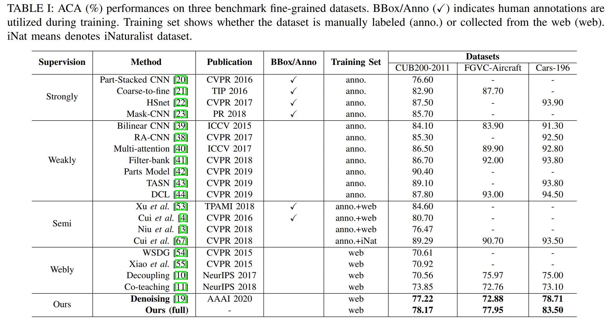

# Exploiting Web Images for Fine-Grained Visual Recognition by Eliminating Open-set Noise

Introduction
------------
This is the source code for our paper **Exploiting Web Images for Fine-Grained Visual Recognition by Eliminating Open-set Noise**

Network Architecture
--------------------
The architecture of our proposed model is as follows


Installation
------------
After creating a virtual environment of python 3.7, run `pip install -r requirements.txt` to install all dependencies

How to use
------------
The code is currently tested only on GPU
* **Data Preparation**
    - Download data into project root directory and uncompress them using
        ```
        wget https://wsnfg-sh.oss-cn-shanghai.aliyuncs.com/web-bird.tar.gz
        wget https://wsnfg-sh.oss-cn-shanghai.aliyuncs.com/web-car.tar.gz
        wget https://wsnfg-sh.oss-cn-shanghai.aliyuncs.com/web-aircraft.tar.gz
        tar -xvf web-bird.tar.gz
        tar -xvf web-car.tar.gz
        tar -xvf aircraft-car.tar.gz
        ```
* **Source Code**

    - If you want to train the whole network from begining using source code on the web fine-grained dataset, please follow subsequent steps
    
      - Choose a dataset, create soft link to dataset by
       ```
       ln -s web-bird bird
       ln -s web-car car
       ln -s web-aircraft aircraft
       ```

      - Modify `CUDA_VISIBLE_DEVICES` to proper cuda device id and `data_base` to proper dataset in  ``` run.sh ```
      
      - Activate virtual environment(e.g. conda) and then run the script```bash train.sh``` to train a resnet model or ```bash train_bcnn.sh``` to train a vgg model. We recommand you to use resnet-18 backbone, because it needs less memory and time to train.
      
    
